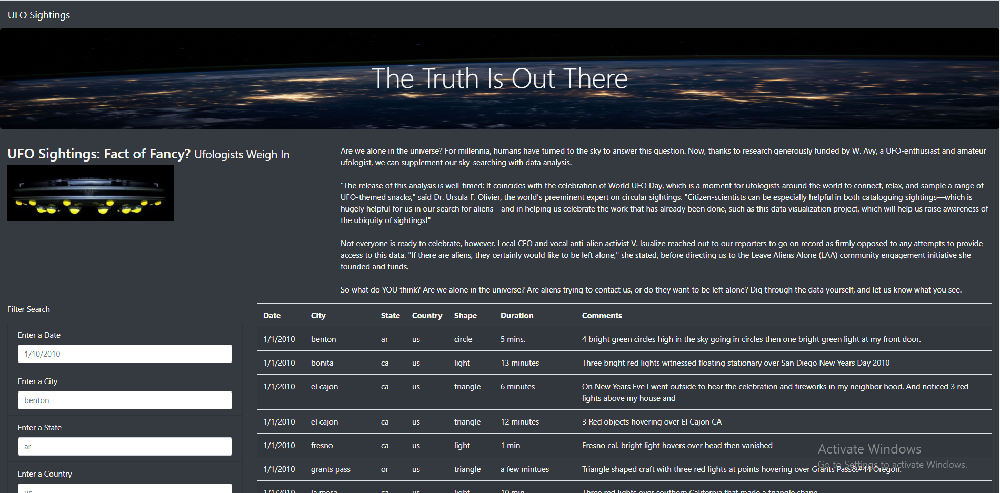
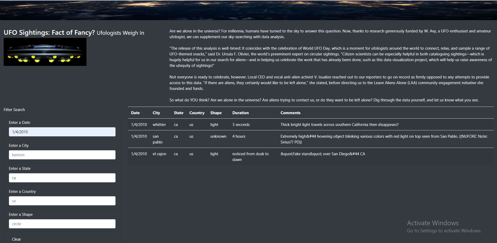

# UFOs
## Project Overview
The project requires us to build an website to show the UFO sightings and various places in USA. The webpage shows the details of the UFO sightings and other details . It provides the user to filter the data using the date provided by the user.
## Resources
- Data Source: data.js
- Software: Javascript and Html.
 ## UFO Finder website :
The UFO finder website shows the data of various data related to the UFO sighting in USA. The user can filter the data using the date of the sighting.
 
## Challenge Overview
The challenge's objective was to include the below mentioned filter criteria using the javascript code for the filtering the data :
1. Date
2. City
3. State
4. Country
5. Shape
## Challenge Summary
The UFO website now have the above mentioned filter criteria for the user to filter the data .

